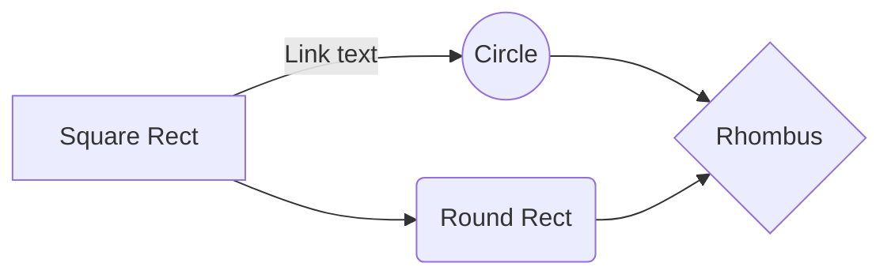

mermaid is a very good tool to draw simple diagram.

[official site](https://mermaid-js.github.io/mermaid/#/)

most example can be found in the official website.

The most simple example of flowchat.

