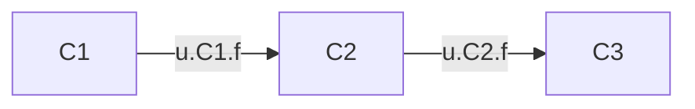
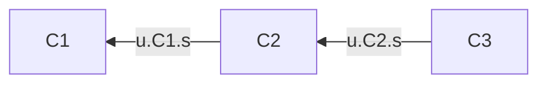

Most content of this post is from *Introduction to Algorithms*. I will explain idea in a simple way but without any prove.

### Strongly connected components

The definition of strongly connected components of a directed graph $G= (V, E)$ is amximal set of vertices$C\subseteq  V$ such that for every pair of vertices $u$ and $v$ in $C$, we have both $u \leadsto v$ and $v\leadsto u$; that is, verices $u$ and $v$ are reachable from each other.

The algorithm list as below. 

**STRONGLY-CONNECTED-COMPONENTS(G)**

1. Call $DFS(G)$ to compute finishing time $u.f$ for each vertex $u$ 

2. compute $G^T$ 

3. call $DFS(G^T)$, but in the main loop of $DFS$consider the vertices in order of decreasing $u.f$ (as computed in line 1)

4. output the vertices of each tree in the depth-first forest formed in line 3 as a separated strongly connected component.

**Lemma** 

Let $C$ and $C'$ be distinct strongly connected components in directed graph $G=(V,E)$. Suppose that there is an edge $(u,v) \in E$ where $u\in C$ and $v \in C'$. Then $f(C) > f(C')$.

**Corollary**

Let $C$ and $C'$ be distinct strongly connected components in directed graph $G=(V,E)$. Suppose that there is an edge $(u,v) \in E^T$ where $u\in C$ and $v \in C'$. Then $f(C) < f(C')$.

when we consider backwards

For example, we focus at get component $C2$. This may not the only node it can go $C3$, but it will no have other node can go back to $C2$.   

**Theorem**

The STRONGLY-CONNECTED-COMPONENTS(G) procedure correctly computes the strongly connected components of directed graph $G$ provided as its input.

